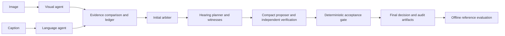

# Architecture

`run_figdebate.py` is the official runner. Stagewise execution loads the large
models in separate stages to fit the supported GPU profile.

| Responsibility | Main modules |
|---|---|
| CLI, manifests and run lifecycle | `run_figdebate.py`, `engine/run_integrity.py`, `engine/result_store.py` |
| Stage scheduling and checkpoints | `engine/batch_runner.py`, `engine/bounded_batches.py` |
| Atomic visual questions and delivery validation | `agents/visual_adapter.py`, `agents/visual_grounding.py` |
| Source claim interpretation | `agents/claim_extraction.py`, `engine/claim_graph.py`, `engine/source_spans.py` |
| Initial decision | `arbiter/arbiter.py` |
| Compact tribunal proposal | `engine/simple_judge.py` |
| Independent visual, role, relation and challenge checks | `engine/evidence_review_v5.py` |
| Repair routing and bounded scheduling | `engine/tribunal_repair.py`, `engine/case_budget.py` |
| Acceptance and evidence binding | `engine/tribunal.py`, `engine/semantic_bridge.py`, `engine/independent_review.py` |
| Decode-time structure and post-validation | `engine/structured_decoder.py`, `engine/output_contracts.py` |
| Reference similarity after inference | `evaluation/reasoning_similarity.py` |

Source spans preserve exact caption identity; they are not a visual entity
detector. Structured decoding constrains legal output structure, not truth.
NLI is diagnostic and cannot manufacture visual evidence. A model proposal is
not an acceptance certificate. Feedback is disabled in the current runbook.

The handoff changes only two visual answer limits in inference code. It does not
replace any model, prompt, source-span mechanism, arbiter, tribunal or acceptance
policy. Historical and ablation modules remain because existing execution modes
and regression tests still depend on them.
